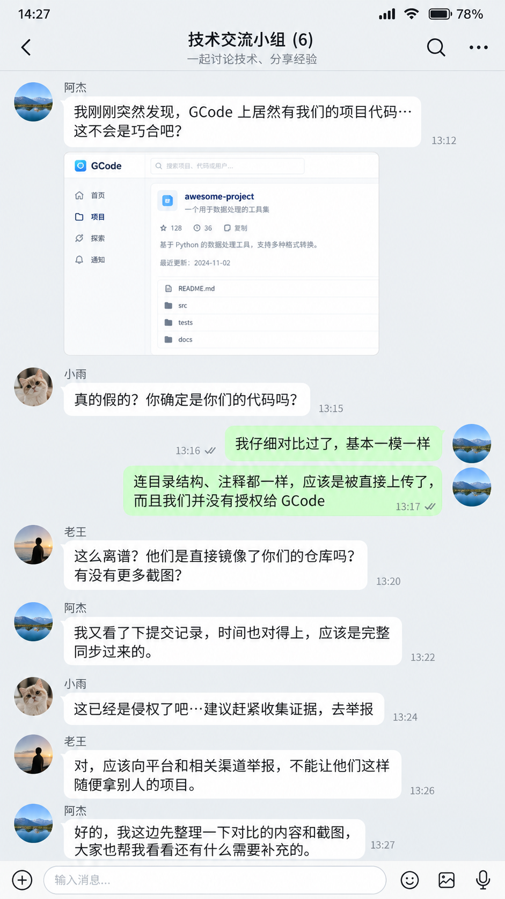

<p align="center">
  
</p>
<h1 align="center">Laodi · 老底</h1>

<p>
  
</p>

<h3>担心自己的 Git 历史被第三方工具悄悄上传？</h3>
<p>Laodi 保护你的 Git 老底。</p>
<p>skill 适配，无缝接入。</p>
<p>有小动作，及时提醒。</p>

<p align="left">
  <br><br><br><br>
  
</p>

<br clear="all">

Laodi 是 AI 编程工具的隐私监控，检查 snapshot 与上传记录、工具输出中的疑似凭据，提醒并拦截。

## 作用

| 检测范围 | 默认反馈 |
| --- | --- |
| **某APP 和其他编程工具**的快照记录：Git 对象、LFS、Workspace | 记录并通知 |
| **某APP 和其他编程工具**中，Bash、Read 请求里的敏感文件访问 | 仅记录，不弹通知 |
| 输出中出现疑似令牌、私钥或凭据赋值 | 脱敏记录并通知 |
| 持续解析异常、读取失败或事件队列缺口 | 记录并限频提醒 |
| Git 历史打包（需手动启用） | 限制归档目录读写 |

默认监测无须管理员权限，不改命令、不拒绝工具调用、不修改代理。输入输出仅在本地检测，不保存原文和密钥。

## 安装和更新

**macOS**：

```sh
curl -fsSL https://raw.githubusercontent.com/Shenrui-Ma/Laodi/main/install.sh | sh
```

已安装时会更新，保留配置和事件记录。

[Release 与校验文件](https://github.com/Shenrui-Ma/Laodi/releases/tag/v0.4.1-beta.1) · [查看安装脚本](install.sh) · [详细说明](docs/BINARY-INSTALL.md)

查看状态：

```sh
"$HOME/Library/Application Support/Laodi-skills/runtime/laodi" status
```

**Windows 11 x64（BETA）**：

在 PowerShell 中安装：

```powershell
& ([scriptblock]::Create((Invoke-WebRequest -UseBasicParsing 'https://raw.githubusercontent.com/Shenrui-Ma/Laodi/v0.4.1-windows.beta.2/install.ps1').Content)) -Version 'v0.4.1-windows.beta.2'
```

安装后查询状态与提醒：

```powershell
$Laodi = Join-Path $env:LOCALAPPDATA 'Laodi-skills\laodi.exe'
& $Laodi status
& $Laodi incidents --format agent-summary
& $Laodi notifications status
& $Laodi update --version 'v0.4.1-windows.beta.2'
```

Windows 端当前提供工具监测和通知，暂不提供 Git 历史打包限制。[Windows 使用说明](docs/WINDOWS.md)

Skill 随包提供，方便 Agent 查询；不影响后台独立运行。

## 架构

```text
已支持的快照文件 ───────────────────┐
                                  ↓
已接入编程工具的异步 Hook → 私有事件队列 → Go 守护进程
                                              ├─ 脱敏记录 → CLI / Skill 查询
                                              └─ 系统通知（macOS / Windows）
```

## 提醒后自查

| 提醒 | 已做 | 处理 |
| --- | --- | --- |
| 敏感访问请求 | 仅记录 | 授权内操作可继续 |
| 输出疑似凭据 | 脱敏记录、通知 | 核对用途；真实凭据可能暴露时撤销或轮换 |
| 快照 / 上传记录 | 记录、通知 | 查事件与保护状态，按需限制 Git 历史打包 |
| 监测或保护异常 | 诊断、提醒 | 查 `status`、`doctor`、`protect status` |

老底自动监测并执行已启用的归档限制。接入 Skill 后，可直接询问 Agent：“查看老底提醒，告诉我怎么处理。”也可用命令查询：

```sh
"$HOME/Library/Application Support/Laodi-skills/runtime/laodi" incidents --format agent-summary
```

| 授权分类 | 例子 |
| --- | --- |
| 授权内 | 明确指定文件进行读取、修改，或分析指定提交；把用户给的 key 用于指定服务认证 |
| 授权外 | 只授权改代码却额外上传完整历史；把认证用 key 回显或发送给另一服务，且没有相应授权 |
| 待核实 | 只有路径、系统权限或快照线索，缺少任务、设置与目的地证据 |

## Git 历史打包（BETA）

**macOS**：

限制客户端在后台打包项目、Git 历史或配置，供后续上传。

正常退出客户端后，执行一次：

```sh
"$HOME/Library/Application Support/Laodi-skills/runtime/laodi" protect enable
```

之后照常打开客户端。`protect status` 查看状态，`protect disable` 撤销；撤销前同样需退出客户端。

仅限制适配版本的归档路径，不阻止文件读取或普通模型请求。[支持范围与恢复](docs/PROTECTION.md)

## 实测

涉及 **某APP** 的相关实验基于其 `3.12.3`（补丁前版本）展开。
`v0.4.0-preview.1` · Apple M5 Pro / macOS 26.3。合成数据测试。

| 项目 | 结果 |
| --- | --- |
| 凭据输出检测 | 检出 **24/24** · 误报 **0/30** |
| 敏感访问检测 | 检出 **26/26** · 误报 **0/18** |
| 快照与状态识别 | 检出 **10/10** · 误报 **0/10** |
| 关键词基线对照 | 误报 **16/30 → 0/30** · 检出均为 **24/24** |
| 归档阻断 | 拒绝 **9/9** · 接收 **0/9** |
| Git / checkpoint 兼容 | 通过 **27/27** |
| 待传包撤销恢复 | 同一密文恢复 **9/9** |
| 流程验证 / 重建回放 | 符合预期 **15/15** / **10/10** |
| 真实任务通知 | 用户确认 **1 次**可见提醒 · 客户端回报 **8 项**测试通过 |

检测使用两种 Hook 协议的配对样本，表中为**支持格式集**。挑战集有 38 项未检出：23 项报告覆盖缺口，15 项漏检；其中输出挑战集关键词基线检出 4/18，老底为 0/18。流程验证含未触发对照，不全是阻断测试。

### 消融实验

先对比三种合成程序在保护开关前后的发送结果，再逐项移除保护组件。测试新建归档和读取待传包，每种操作重复 3 次。

| 实现 | 未保护接收 | 保护后接收 | 系统拒绝 | 撤销后接收 |
| --- | --- | --- | --- | --- |
| Python | 6/6 | **0/6** | **6/6** | 6/6 |
| Node | 6/6 | **0/6** | **6/6** | 6/6 |
| Shell + curl | 6/6 | **0/6** | **6/6** | 6/6 |

| 组件消融 | 接收结果 |
| --- | --- |
| 首次工作区：完整保护 / 仅移除目录继承 | **0/3 → 3/3** |
| 已有待传包：目录限制、读取限制都保留 | **0/3** |
| 已有待传包：仅保留其中一项限制 | 两组均 **0/3** |
| 已有待传包：两项限制都移除 | **3/3** |

## 卸载

```sh
"$HOME/Library/Application Support/Laodi-skills/runtime/laodi" remove
```

## TODO

- [ ] Windows 端功能对齐。
- [ ] 针对纯内存上传情况的观测。

## 文档

- [工具 Hook：接入协议、检测规则与隐私边界](docs/TOOL-HOOKS.md)
- [系统通知：授权、状态与送达边界](docs/NOTIFICATIONS.md)

[开发说明](docs/DEVELOPMENT.md) · [发布构建](scripts/release)

## 许可证

原创代码与文档采用 [MIT License](LICENSE)。宣传 PNG 素材不自动纳入 MIT 授权，使用范围见 [素材说明](assets/README.md)。
